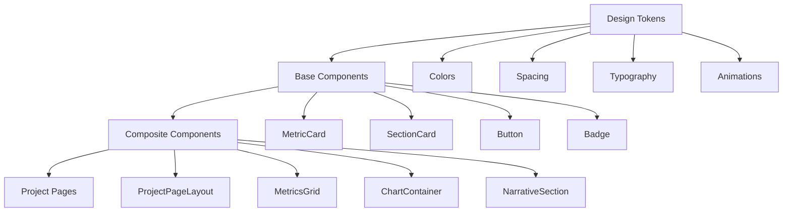

# Design Document

## Overview

This design establishes a comprehensive UI/UX consistency framework for all project sub-pages in the portfolio website. The solution implements a unified design system with standardized components, layouts, and interaction patterns to create a cohesive user experience across all project detail pages.

The design follows modern design system principles, leveraging React TypeScript patterns for component composition, and implementing a token-based design system for maintainable consistency. The architecture prioritizes reusability, accessibility, and performance while ensuring visual and functional coherence.

## Architecture

### Component Architecture

The system follows a hierarchical component architecture with three main layers:

1. **Design Tokens Layer**: Foundational design values (colors, spacing, typography, animations)
2. **Base Components Layer**: Atomic UI components (buttons, cards, typography, inputs)
3. **Composite Components Layer**: Complex project-specific components (project layouts, metric displays, chart containers)



### Layout System Architecture

The layout system uses a flexible grid-based approach with consistent breakpoints and spacing:

- **Container**: Max-width 7xl (1280px) with responsive padding
- **Grid System**: CSS Grid with standardized column layouts (1, 2, 3, 4 columns)
- **Spacing Scale**: 4px base unit with consistent multipliers (4, 8, 12, 16, 24, 32, 48, 64px)
- **Breakpoints**: Mobile (640px), Tablet (768px), Desktop (1024px), Large (1280px)

## Components and Interfaces

### Core Component Interfaces

#### ProjectPageLayout Component

```typescript
interface ProjectPageLayoutProps {
  title: string
  description: string
  tags: ProjectTag[]
  children: ReactNode
  navigation?: NavigationConfig
  metrics?: MetricConfig[]
  showTimeframes?: boolean
  timeframes?: string[]
  activeTimeframe?: string
  onTimeframeChange?: (timeframe: string) => void
  onRefresh?: () => void
  refreshButtonDisabled?: boolean
}

interface ProjectTag {
  label: string
  variant: 'primary' | 'secondary' | 'success' | 'warning' | 'info'
}

interface NavigationConfig {
  backUrl: string
  backLabel: string
  breadcrumbs?: BreadcrumbItem[]
}
```

#### MetricCard Component

```typescript
interface MetricCardProps {
  icon: LucideIcon
  label: string
  value: string | number
  subtitle?: string
  variant: 'primary' | 'secondary' | 'success' | 'warning' | 'info'
  trend?: {
    direction: 'up' | 'down' | 'neutral'
    value: string
    label: string
  }
  animationDelay?: number
  loading?: boolean
}
```

#### SectionCard Component

```typescript
interface SectionCardProps {
  title: string
  description?: string
  children: ReactNode
  variant?: 'default' | 'glass' | 'gradient'
  padding?: 'sm' | 'md' | 'lg'
  className?: string
}
```

#### ChartContainer Component

```typescript
interface ChartContainerProps {
  title: string
  description?: string
  children: ReactNode
  height?: number
  loading?: boolean
  error?: string
  actions?: ChartAction[]
}

interface ChartAction {
  label: string
  icon?: LucideIcon
  onClick: () => void
  variant?: 'primary' | 'secondary'
}
```

### Design Token System

#### Color Tokens

```typescript
const designTokens = {
  colors: {
    primary: {
      50: 'hsl(var(--primary-50))',
      500: 'hsl(var(--primary))',
      900: 'hsl(var(--primary-900))',
    },
    secondary: {
      50: 'hsl(var(--secondary-50))',
      500: 'hsl(var(--secondary))',
      900: 'hsl(var(--secondary-900))',
    },
    success: {
      50: 'hsl(var(--success-50))',
      500: 'hsl(var(--success))',
      900: 'hsl(var(--success-900))',
    },
    // ... additional color scales
  },
  spacing: {
    xs: '0.25rem', // 4px
    sm: '0.5rem', // 8px
    md: '1rem', // 16px
    lg: '1.5rem', // 24px
    xl: '2rem', // 32px
    '2xl': '3rem', // 48px
    '3xl': '4rem', // 64px
  },
  typography: {
    fontFamily: {
      display: 'var(--font-display)',
      body: 'var(--font-body)',
    },
    fontSize: {
      xs: ['0.75rem', { lineHeight: '1rem' }],
      sm: ['0.875rem', { lineHeight: '1.25rem' }],
      base: ['1rem', { lineHeight: '1.5rem' }],
      lg: ['1.125rem', { lineHeight: '1.75rem' }],
      xl: ['1.25rem', { lineHeight: '1.75rem' }],
      '2xl': ['1.5rem', { lineHeight: '2rem' }],
      '3xl': ['1.875rem', { lineHeight: '2.25rem' }],
      '4xl': ['2.25rem', { lineHeight: '2.5rem' }],
    },
  },
}
```

## Data Models

### Project Data Model

```typescript
interface Project {
  id: string
  slug: string
  title: string
  description: string
  longDescription?: string
  category: ProjectCategory
  tags: string[]
  technologies: string[]
  image?: string
  featured: boolean
  metrics?: ProjectMetric[]
  starData?: STARData
  createdAt: Date
  updatedAt?: Date
  viewCount: number
  clickCount: number
  liveUrl?: string
  githubUrl?: string
}

interface ProjectMetric {
  id: string
  label: string
  value: string | number
  subtitle?: string
  variant: MetricVariant
  trend?: MetricTrend
  icon?: string
}

interface STARData {
  situation: STARPhase
  task: STARPhase
  action: STARPhase
  result: STARPhase
}

interface STARPhase {
  phase: string
  impact: number
  efficiency: number
  value: number
}
```

### Layout Configuration Model

```typescript
interface LayoutConfig {
  maxWidth: string
  padding: SpacingToken
  grid: {
    columns: number
    gap: SpacingToken
    breakpoints: Record<string, number>
  }
  sections: SectionConfig[]
}

interface SectionConfig {
  id: string
  title: string
  order: number
  required: boolean
  component: string
  props?: Record<string, any>
}
```

## Correctness Properties

_A property is a characteristic or behavior that should hold true across all valid executions of a system-essentially, a formal statement about what the system should do. Properties serve as the bridge between human-readable specifications and machine-verifiable correctness guarantees._

### Property 1: Layout Consistency

_For any_ project page, the header structure should contain the same elements in the same order: back navigation, title, description, and tags
**Validates: Requirements 1.1, 1.2**

### Property 2: Component Uniformity

_For any_ metric card component across all project pages, the styling, spacing, and data formatting should be identical when given the same variant and data type
**Validates: Requirements 3.1, 3.2**

### Property 3: Navigation Pattern Consistency

_For any_ project page, the back button should have the same styling, positioning, and behavior
**Validates: Requirements 2.1, 2.2**

### Property 4: Design Token Application

_For any_ component using design tokens, the same token should produce identical visual results across all project pages
**Validates: Requirements 4.1, 4.2, 4.3**

### Property 5: Responsive Behavior Consistency

_For any_ project page at the same viewport size, the layout breakpoints and responsive behavior should be identical
**Validates: Requirements 1.5, 4.4**

### Property 6: Content Structure Uniformity

_For any_ project page, the section ordering and content hierarchy should follow the same standardized pattern
**Validates: Requirements 5.1, 5.2**

### Property 7: Interactive Element Consistency

_For any_ interactive element (button, tab, filter) across project pages, the hover states, focus indicators, and click feedback should be identical
**Validates: Requirements 6.1, 6.2, 6.5**

### Property 8: Data Formatting Consistency

_For any_ metric or data value of the same type across project pages, the formatting (currency, percentage, numbers) should be identical
**Validates: Requirements 8.1, 8.2, 8.4**

### Property 9: Accessibility Pattern Consistency

_For any_ project page, the semantic HTML structure, ARIA labels, and keyboard navigation patterns should be identical
**Validates: Requirements 7.2, 7.3, 7.4**

### Property 10: Loading State Uniformity

_For any_ loading state across project pages, the skeleton components and loading animations should be visually identical
**Validates: Requirements 3.5, 7.1**

## Error Handling

### Component Error Boundaries

- **Graceful Degradation**: Components fail gracefully with fallback UI
- **Error Logging**: Consistent error reporting across all project pages
- **User Feedback**: Standardized error messages and recovery actions

### Data Loading Error Handling

- **Loading States**: Consistent skeleton components during data fetching
- **Error States**: Uniform error display with retry mechanisms
- **Empty States**: Standardized empty state messaging and actions

### Accessibility Error Prevention

- **Focus Management**: Consistent focus trapping and restoration
- **Screen Reader Support**: Uniform ARIA label patterns and announcements
- **Keyboard Navigation**: Standardized keyboard interaction patterns

## Testing Strategy

### Unit Testing Approach

- **Component Testing**: Test individual components in isolation using React Testing Library
- **Visual Regression Testing**: Automated screenshot comparison for visual consistency
- **Accessibility Testing**: Automated a11y testing with jest-axe
- **Integration Testing**: Test component interactions and data flow

### Property-Based Testing Configuration

- **Testing Library**: Use @fast-check/jest for property-based testing
- **Test Iterations**: Minimum 100 iterations per property test
- **Test Environment**: Jest with React Testing Library and jsdom
- **Coverage Requirements**: 90% code coverage for all shared components

### Property Test Implementation

Each correctness property will be implemented as a property-based test with the following structure:

```typescript
// Example property test structure
describe('Property 1: Layout Consistency', () => {
  test('header structure consistency across project pages', () => {
    fc.assert(fc.property(
      fc.record({
        title: fc.string(),
        description: fc.string(),
        tags: fc.array(fc.record({
          label: fc.string(),
          variant: fc.constantFrom('primary', 'secondary', 'success', 'warning', 'info')
        }))
      }),
      (projectData) => {
        const { container } = render(<ProjectPageLayout {...projectData} />)

        // Verify header structure
        const header = container.querySelector('[data-testid="project-header"]')
        expect(header).toBeInTheDocument()

        // Verify element order
        const backButton = header?.querySelector('[data-testid="back-button"]')
        const title = header?.querySelector('[data-testid="project-title"]')
        const description = header?.querySelector('[data-testid="project-description"]')
        const tags = header?.querySelector('[data-testid="project-tags"]')

        expect(backButton).toBeInTheDocument()
        expect(title).toBeInTheDocument()
        expect(description).toBeInTheDocument()
        expect(tags).toBeInTheDocument()

        // Verify order using DOM position
        const elements = [backButton, title, description, tags]
        for (let i = 0; i < elements.length - 1; i++) {
          expect(elements[i]!.compareDocumentPosition(elements[i + 1]!))
            .toBe(Node.DOCUMENT_POSITION_FOLLOWING)
        }
      }
    ))
  })
})
```

### Testing Tags and Requirements Mapping

- **Feature: project-ui-consistency, Property 1**: Layout Consistency - **Validates: Requirements 1.1, 1.2**
- **Feature: project-ui-consistency, Property 2**: Component Uniformity - **Validates: Requirements 3.1, 3.2**
- **Feature: project-ui-consistency, Property 3**: Navigation Pattern Consistency - **Validates: Requirements 2.1, 2.2**
- **Feature: project-ui-consistency, Property 4**: Design Token Application - **Validates: Requirements 4.1, 4.2, 4.3**
- **Feature: project-ui-consistency, Property 5**: Responsive Behavior Consistency - **Validates: Requirements 1.5, 4.4**
- **Feature: project-ui-consistency, Property 6**: Content Structure Uniformity - **Validates: Requirements 5.1, 5.2**
- **Feature: project-ui-consistency, Property 7**: Interactive Element Consistency - **Validates: Requirements 6.1, 6.2, 6.5**
- **Feature: project-ui-consistency, Property 8**: Data Formatting Consistency - **Validates: Requirements 8.1, 8.2, 8.4**
- **Feature: project-ui-consistency, Property 9**: Accessibility Pattern Consistency - **Validates: Requirements 7.2, 7.3, 7.4**
- **Feature: project-ui-consistency, Property 10**: Loading State Uniformity - **Validates: Requirements 3.5, 7.1**

### Dual Testing Approach

The testing strategy employs both unit tests and property-based tests as complementary approaches:

- **Unit Tests**: Verify specific examples, edge cases, and integration points between components
- **Property Tests**: Verify universal properties hold across all inputs and component variations
- **Visual Tests**: Ensure consistent visual appearance across different data inputs and states
- **Accessibility Tests**: Validate consistent accessibility patterns and compliance

This comprehensive testing approach ensures both functional correctness and visual consistency across all project pages while maintaining high code quality and user experience standards.
