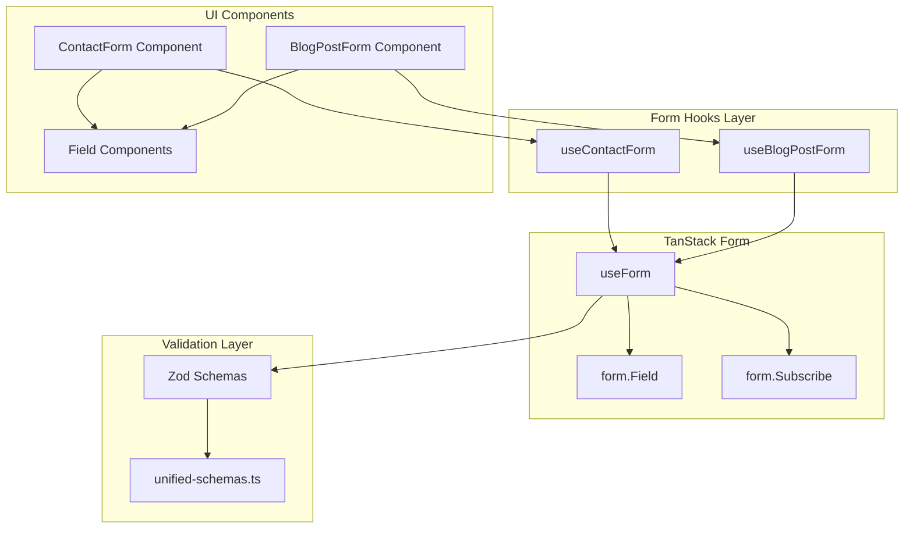
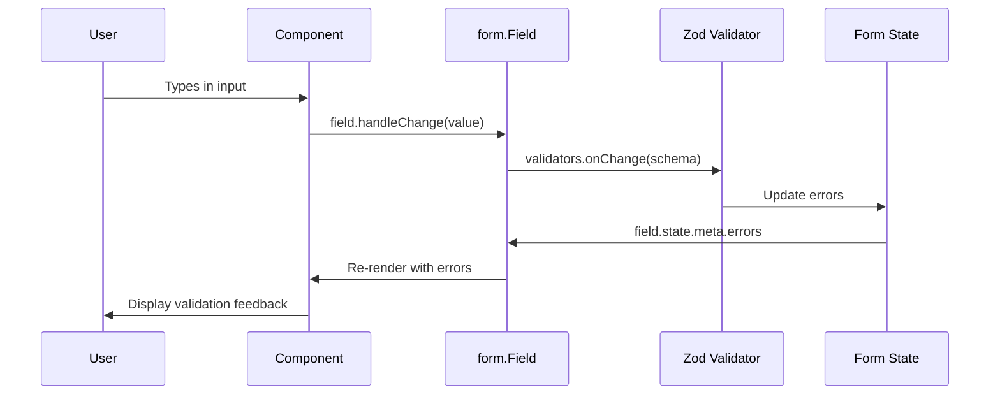

# Design Document: TanStack Form Migration

## Overview

This design document outlines the migration from react-hook-form to TanStack Form (@tanstack/react-form) for the portfolio application. The migration follows a direct integration approach, using TanStack Form's `useForm` hook in each form hook while composing with existing shadcn/ui Field components.

The design prioritizes:

- Minimal changes to existing component structure
- Type-safe form state management
- Seamless Zod v4 schema validation integration
- Preserved user experience

## Architecture

### High-Level Architecture



### Form State Flow



## Components and Interfaces

### useContactForm Hook

The contact form hook will be refactored to use TanStack Form while maintaining the same public interface.

```typescript
import { useForm } from '@tanstack/react-form'
import { contactFormSchema } from '@/lib/validations/unified-schemas'

interface ContactFormData {
  name: string
  email: string
  company: string
  phone: string
  message: string
}

interface UseContactFormReturn {
  // TanStack Form instance
  form: ReturnType<typeof useForm<ContactFormData>>

  // Additional state
  showPrivacy: boolean
  agreedToTerms: boolean
  progress: number
  submitStatus: 'idle' | 'submitting' | 'success' | 'error'

  // Actions
  setShowPrivacy: (show: boolean) => void
  setAgreedToTerms: (agreed: boolean) => void
  resetForm: () => void
}
```

### useBlogPostForm Hook

The blog post form hook will be refactored similarly:

```typescript
import { useForm } from '@tanstack/react-form'
import { blogPostFormSchema, type BlogPostFormData } from '@/hooks/use-blog-post-form'

interface UseBlogPostFormReturn {
  // TanStack Form instance
  form: ReturnType<typeof useForm<BlogPostFormData>>

  // Additional state
  selectedTags: string[]
  newKeyword: string
  previewMode: boolean

  // Actions
  setSelectedTags: (tags: string[]) => void
  setNewKeyword: (keyword: string) => void
  setPreviewMode: (mode: boolean) => void
  handleTitleChange: (title: string) => void
  addKeyword: () => void
  removeKeyword: (keyword: string) => void
  toggleTag: (tagId: string) => void
  generateSlug: (title: string) => string
}
```

### TanStack Form Field Pattern

Fields will be rendered using the `form.Field` component with shadcn/ui Field components:

```typescript
<form.Field
  name="email"
  validators={{
    onChange: z.email('Please enter a valid email'),
  }}
>
  {(field) => (
    <Field data-invalid={field.state.meta.errors.length > 0}>
      <FieldLabel htmlFor={field.name}>Email</FieldLabel>
      <Input
        id={field.name}
        value={field.state.value}
        onChange={(e) => field.handleChange(e.target.value)}
        onBlur={field.handleBlur}
        aria-invalid={field.state.meta.errors.length > 0}
      />
      {field.state.meta.errors.length > 0 && (
        <FieldError>{field.state.meta.errors[0]}</FieldError>
      )}
    </Field>
  )}
</form.Field>
```

### Form Submission Pattern

Form submission will use `form.handleSubmit()` with the `form.Subscribe` component for reactive state:

```typescript
<form
  onSubmit={(e) => {
    e.preventDefault()
    form.handleSubmit()
  }}
>
  {/* Fields */}

  <form.Subscribe
    selector={(state) => [state.canSubmit, state.isSubmitting]}
  >
    {([canSubmit, isSubmitting]) => (
      <Button type="submit" disabled={!canSubmit || !agreedToTerms}>
        {isSubmitting ? 'Sending...' : 'Send Message'}
      </Button>
    )}
  </form.Subscribe>
</form>
```

## Data Models

### Contact Form Schema (Existing - No Changes)

The existing Zod schema in `unified-schemas.ts` will be used directly:

```typescript
export const contactFormSchema = z.object({
  name: z.string().min(2).max(50).trim(),
  email: emailSchema, // Uses z.email() pattern
  company: z.string().max(100).trim().optional().or(z.literal('')),
  phone: z
    .string()
    .max(20)
    .regex(/^[\d\s+()-]*$/)
    .optional()
    .or(z.literal('')),
  message: z.string().min(10).max(1000).trim(),
  honeypot: z.string().optional(),
})
```

### Blog Post Form Schema (Existing - No Changes)

The existing schema in `use-blog-post-form.ts` will be used:

```typescript
export const blogPostFormSchema = z.object({
  title: z.string().min(5).max(200),
  slug: z
    .string()
    .min(1)
    .regex(/^[a-z0-9]+(?:-[a-z0-9]+)*$/),
  excerpt: z.string().max(500).optional(),
  content: z.string().min(100),
  contentType: z.enum(['MARKDOWN', 'HTML', 'RICH_TEXT']),
  status: z.enum(['DRAFT', 'REVIEW', 'SCHEDULED', 'PUBLISHED', 'ARCHIVED', 'DELETED']),
  // ... additional fields
})
```

### Form State Types

TanStack Form provides built-in types for form state:

```typescript
import type { FormApi, FieldApi } from '@tanstack/react-form'

// Form state includes:
interface FormState<T> {
  values: T
  errors: string[]
  isSubmitting: boolean
  isValidating: boolean
  canSubmit: boolean
  isDirty: boolean
  isTouched: boolean
}

// Field state includes:
interface FieldState<T> {
  value: T
  meta: {
    errors: string[]
    isTouched: boolean
    isValidating: boolean
  }
}
```

## Correctness Properties

_A property is a characteristic or behavior that should hold true across all valid executions of a system—essentially, a formal statement about what the system should do. Properties serve as the bridge between human-readable specifications and machine-verifiable correctness guarantees._

Based on the prework analysis, the following correctness properties have been identified. Properties that were redundant have been consolidated.

### Property 1: Form Value Updates on Change

_For any_ form field and any valid input value, calling `field.handleChange(value)` SHALL update `field.state.value` to equal the provided value.

**Validates: Requirements 3.1, 4.1**

### Property 2: Validation Triggers on Blur

_For any_ form field with validators, calling `field.handleBlur()` SHALL trigger validation and populate `field.state.meta.errors` with any validation failures.

**Validates: Requirements 3.2**

### Property 3: Valid Submission Calls Handler

_For any_ form with valid data (passing all Zod schema validations), calling `form.handleSubmit()` SHALL invoke the `onSubmit` handler with the validated form values.

**Validates: Requirements 3.3, 4.2**

### Property 4: Invalid Submission Shows Errors

_For any_ form with invalid data (failing Zod schema validation), calling `form.handleSubmit()` SHALL NOT invoke `onSubmit` and SHALL populate `field.state.meta.errors` for invalid fields.

**Validates: Requirements 3.4, 4.3**

### Property 5: Error State Attribute

_For any_ form field where `field.state.meta.errors.length > 0`, the Field component SHALL have `data-invalid="true"` attribute set.

**Validates: Requirements 5.1, 5.5**

### Property 6: Error Message Display

_For any_ form field that is touched (`field.state.meta.isTouched === true`) and has errors (`field.state.meta.errors.length > 0`), the FieldError component SHALL render the first error message from the errors array.

**Validates: Requirements 5.3, 5.6**

### Property 7: Progress Computation

_For any_ combination of contact form field values and `agreedToTerms` state, the `progress` value SHALL be computed as a percentage (0-100) based on the number of valid required fields filled.

**Validates: Requirements 3.10**

### Property 8: Slug Generation

_For any_ non-empty title string, the `generateSlug` function SHALL produce a valid slug containing only lowercase letters, numbers, and hyphens, with no leading/trailing hyphens.

**Validates: Requirements 4.5**

### Property 9: Array Field Operations

_For any_ array field (keywords, tagIds), calling add operation SHALL increase array length by 1 and contain the new item, and calling remove operation SHALL decrease array length by 1 and not contain the removed item.

**Validates: Requirements 4.6, 4.7**

### Property 10: Required Fields Validation

_For any_ contact form submission where name, email, or message is empty or whitespace-only, validation SHALL fail and the form SHALL NOT submit.

**Validates: Requirements 7.2**

### Property 11: Submit Button Disabled State

_For any_ form state where `isSubmitting === true` OR `agreedToTerms === false`, the submit button SHALL be disabled.

**Validates: Requirements 7.10**

### Property 12: Zod Schema Round-Trip

_For any_ valid form data object that passes Zod schema validation, parsing the data through the schema SHALL produce an equivalent object (accounting for transformations like `.trim()`).

**Validates: Requirements 6.6**

### Property 13: Form Reset After Success

_For any_ successful form submission, calling `form.reset()` SHALL reset all field values to their `defaultValues`.

**Validates: Requirements 3.6, 7.7**

### Property 14: Default Values Population

_For any_ initial data object passed to `useBlogPostForm`, the form's `defaultValues` SHALL be populated with the corresponding values from the initial data.

**Validates: Requirements 4.4**

## Error Handling

### Validation Errors

TanStack Form handles validation errors through the field state:

```typescript
// Field-level error access
field.state.meta.errors // string[]

// Form-level error access (for cross-field validation)
form.state.errors // string[]
```

Error display pattern:

```typescript
{field.state.meta.isTouched && field.state.meta.errors.length > 0 && (
  <FieldError>{field.state.meta.errors[0]}</FieldError>
)}
```

### Submission Errors

Submission errors are handled in the `onSubmit` handler:

```typescript
const form = useForm({
  onSubmit: async ({ value }) => {
    try {
      const response = await fetch('/api/contact', {
        method: 'POST',
        body: JSON.stringify(value),
      })

      if (!response.ok) {
        const data = await response.json()
        setSubmitStatus('error')
        // Optionally set field-specific errors from API response
        if (data.details) {
          Object.entries(data.details).forEach(([field, messages]) => {
            form.setFieldMeta(field, (prev) => ({
              ...prev,
              errors: messages as string[],
            }))
          })
        }
        return
      }

      setSubmitStatus('success')
      form.reset()
    } catch (error) {
      setSubmitStatus('error')
    }
  },
})
```

### Network Errors

Network errors during submission are caught and result in:

1. `submitStatus` set to `'error'`
2. Form values preserved (no reset)
3. Error message displayed to user

## Testing Strategy

### Dual Testing Approach

The migration will be validated using both unit tests and property-based tests:

- **Unit tests**: Verify specific examples, edge cases, and integration points
- **Property tests**: Verify universal properties across all valid inputs

### Property-Based Testing Configuration

- **Library**: fast-check (already installed in devDependencies)
- **Minimum iterations**: 100 per property test
- **Tag format**: `Feature: tanstack-form-migration, Property {number}: {property_text}`

### Test File Structure

```
src/hooks/__tests__/
  use-contact-form.test.ts      # Unit + property tests for contact form
  use-blog-post-form.test.ts    # Unit + property tests for blog post form

src/components/contact/__tests__/
  ContactForm.test.tsx          # Component integration tests
```

### Unit Test Coverage

1. **Hook initialization**: Verify default values and initial state
2. **Field interactions**: Test handleChange, handleBlur behavior
3. **Form submission**: Test valid/invalid submission flows
4. **Error display**: Test error message rendering
5. **Reset behavior**: Test form reset after submission
6. **Edge cases**: Empty strings, whitespace, special characters

### Property Test Coverage

Each correctness property (1-14) will have a corresponding property-based test:

```typescript
import { fc } from 'fast-check'

// Example: Property 8 - Slug Generation
describe('Property 8: Slug Generation', () => {
  it('generates valid slugs for any non-empty title', () => {
    fc.assert(
      fc.property(
        fc.string({ minLength: 1 }).filter((s) => s.trim().length > 0),
        (title) => {
          const slug = generateSlug(title)
          // Slug contains only valid characters
          expect(slug).toMatch(/^[a-z0-9]+(?:-[a-z0-9]+)*$/)
          // No leading/trailing hyphens
          expect(slug).not.toMatch(/^-|-$/)
        }
      ),
      { numRuns: 100 }
    )
  })
})
```

### Integration Test Coverage

1. **ContactForm component**: Full form flow with TanStack Form
2. **Field component integration**: Verify data-invalid attribute behavior
3. **Submission flow**: API call and response handling
4. **Accessibility**: ARIA attributes and keyboard navigation
